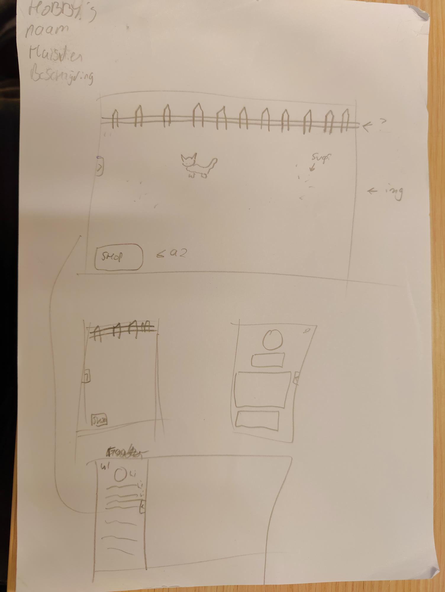
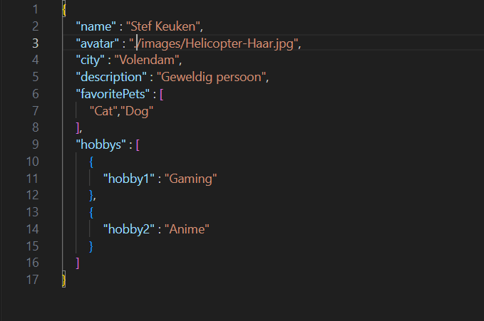
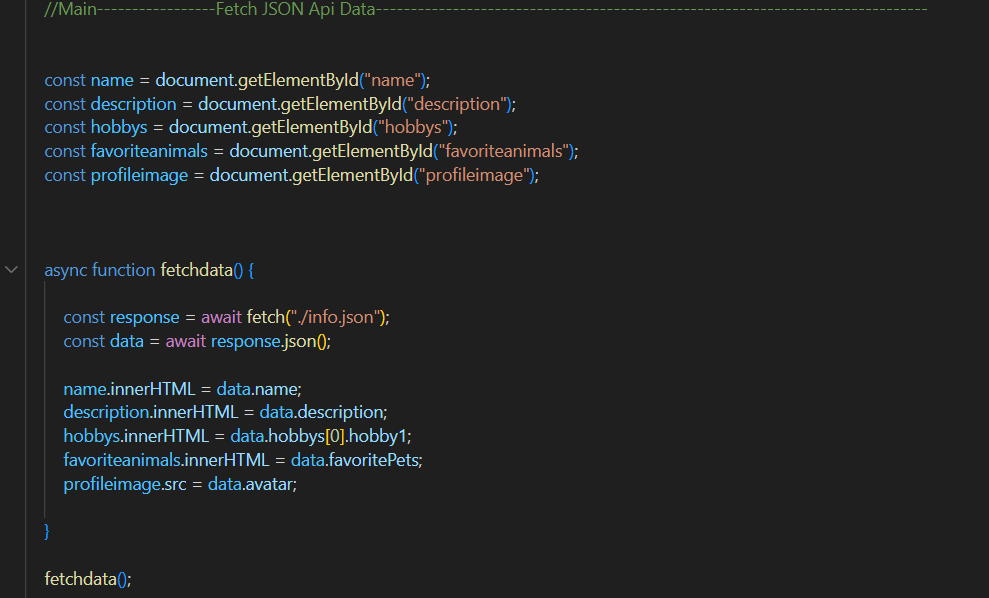
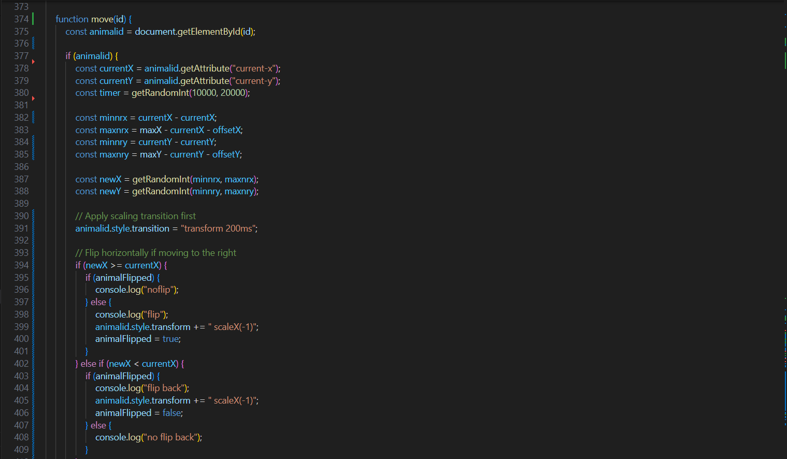
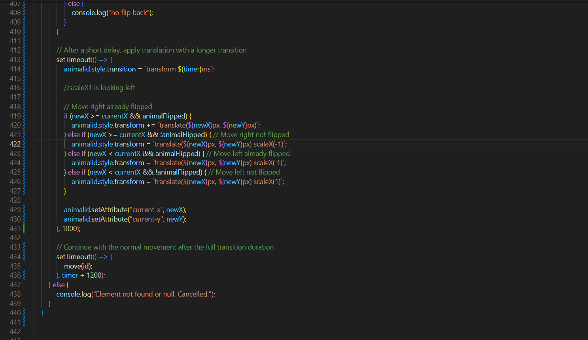
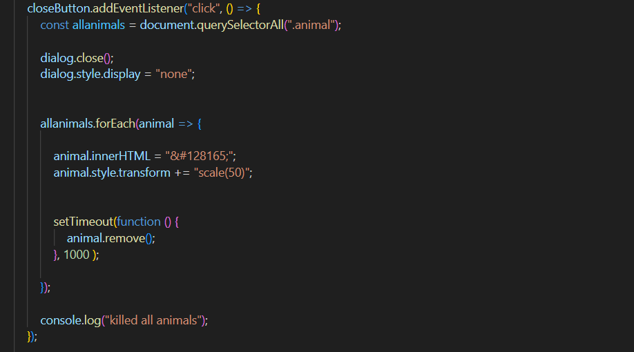
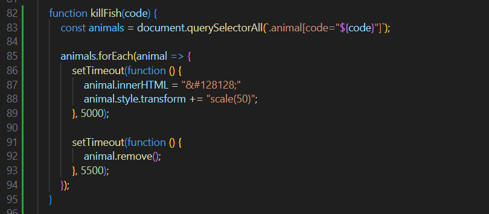
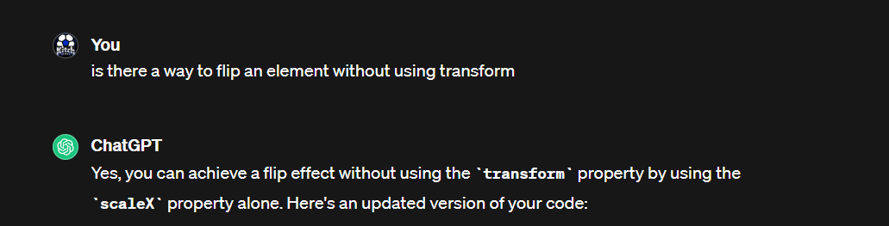
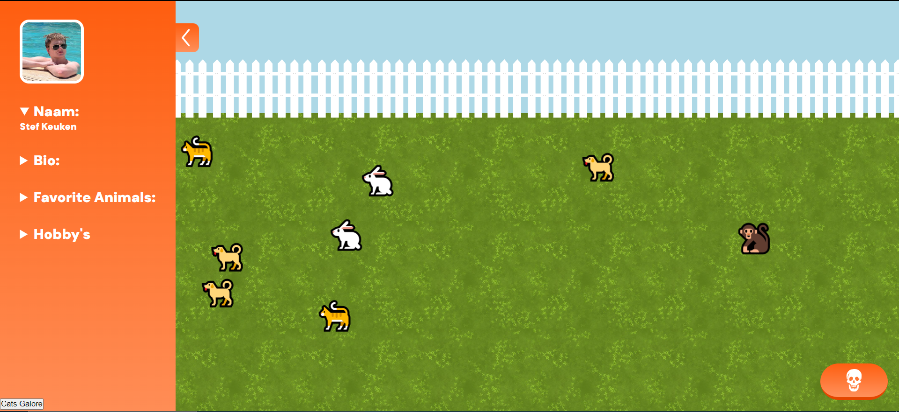

# Web App From Scratch @cmda-minor-web 2023 - 2024

In this readme file you can find everything you need to know about this webapp. The things i write here is the thought process i went through in creating this webapp. It mostly consists of explanations of the things i did and not so much the code since that will be in another file called <a href="https://github.com/Kitch41/Webapps-From-Scratch-23-24/blob/24abbd10b74daee4f038774e4f57f6c1c6cf2bcc/coding.md">coding.md</a>

## Process report

### Day 1 - Kickoff

Today was the first day of the minor. We were shown what we had to make. It was 2 webapps in 8 days! at first it sounded impossible but once i got working i was fired up. we were put into teams of 4 to 5 people. I was put into one with 4 people total.

We went and setup github and pages. and initiallised our page. Then we went and made some sketches of the webapp we wanted to build. I decided to build a webapp where you can buy pets and put them into your app. there they will walk around and move in a random pattern.

Here are some images of the sketches i made:



They may not make a lot of sense to you but for me this is all i need to start working.

A lot of information was given the first day but not a lot of work was done.

#### Checklist:
- Initialise Github ✅
- Setup Pages ✅
- Sketch Idea ✅

#### Sources day 1:
- Github desktop initialize: https://docs.github.com/en/desktop/overview/getting-started-with-github-desktop


### Day 2 - Continuing, styling, JSON

On day 2 we got working on actually thinking up a team webapp idea. we decided on a temporary idea and to think about it again later.
The temporary idea is to make a grid of our "People" where everyone gets a square and you personal information is displayed in there when you hover over it.

I also got working on the menu on the side and the shop menu on the bottom. I decided to do this with javascript by moving it into the screen.
The element i used for the side menu is a footer since this made the most sense. For the shop i used a section since it was going to be containing some buttons and other features.
I made the slide "Animations" using javascript  ``` left: 300px; ```

I also wrote some javascript to fetch data from a json file for future use in the teamwebsite. For this i used the mdn source below.
The json data is just a small file for now but when we start working on the teamwebapp it will probably start looking different.




When i wanted to go home i found out that my webapp wasn't properly linked on github pages. The css and js paths were wrong so at home i fixed this issue aswell. It was the fact that i linked it to specifically (/webapps-from-scratch-23-24/docs/css/styles.css) when i should've just used the shorter code (./css/styles.css).


#### Checklist
- Fetch api ✅
- Menu's Working properly ✅
- Overal Styling ✅
- Properly link github ✅

### Sources 
- mdn fetch api: https://developer.mozilla.org/en-US/docs/Web/API/Fetch_API

### Day 3

Day 3 was a productive one. I managed to get the animal creating work. I also tried to get everything dynamic so that when i add a number into the array it automatically adds a button with that animal and the ability to create that animal. It was a lot harder than i thought since i had to get the data from the api call into the global scope. I managed to do this with the help of Marten. i put the animal code into the data-id of the buttons i created in the fetch function.

I also added some small details to the design and at the end of the day we had out first weekly nerd.

#### Checklist
- Add api. ✅
- Get animals to be created. ✅
- Make everything dynamic. ✅
- Learn from the weekly nerd. ✅


### Sources
- API Emoji: https://github.com/cheatsnake/emojihub
- Create elements using JS: https://developer.mozilla.org/en-US/docs/Web/API/Document/createElement
- Objects: https://developer.mozilla.org/en-US/docs/Web/JavaScript/Reference/Global_Objects/Object


### Day 4

Day 4 was one of the more rough, but rewarding days. I basically spent the whole day thinking of a way to make my animals move in random patterns, and actually putting this method into code. It was a complicated task, But i managed to build something that looks good and works properly. After building it i found out there was another way to move the animals around using css. I want to convert my project for learning purposes but i don't have the time left to rebuild everything using css. And besides that the next part of this minor ill be only using css so i think this will also teach me how to use JS.





#### Checklist
- Make animals move properly ✅
- calculate the math ✅


### Sources
- Marten
- Random number generator: https://developer.mozilla.org/en-US/docs/Web/JavaScript/Reference/Global_Objects/Math/random

### Day 5

Day 5 was a bad start of a day. I started by trying to fix the death animations. It didnt work in the end so i then went with my initial idea. Changing the emoji to the explosion emoji. I first wanted to get it out of my api, But decided against thta. Because when i loaded the api i chose to load only the animal emoji's since they were the only ones i thought i would need. And if i do get all the emoji's i would have to look really far to find the right emoji. So eventhough i could rather easily add it through the api. i decided against that and spent that time trying to fix a few other things. Like making the animals face the way theyre moving. This proved harder than i initially thought. Since i use transform for the movement, Adding scaleX as a transform doesn't work well with translate and transition. One time the cats rotate very slowly and the other time they don't rotate at all. Because this was taking too much time away from the team project i decided to take a screenshot of the code i tried and removed it all. Then i went and made the start of the team project for the rest of the day


at the end of the day the death animations are working and i even made a little easter egg in the game that when you put a fish onto the field it dies after a few seconds since it can't breathe.





#### Checklist
- Get death animations ❌(failed, then found new way) ✅
- Get movement directions ❌(failed, Couldnt get it working due to transform)
- work on team project ✅


### Sources
- Flipping elements: https://stackoverflow.com/questions/17015568/how-to-rotate-flip-element-with-css
- CSS animations: https://developer.mozilla.org/en-US/docs/Web/CSS/CSS_animations/Using_CSS_animations
- Chatgpt: (not much help)<br>



### To do
- Add animals turn to movementdirection. ❌
- Add responsive screen downsizing. (reinitialise move function on screensize) ❌


### Day 6

On day 6 i mostly worked on the team project. I initialised it and fixed the basics. I also tried to fix the rotation of the animals so that they would face the way they moved. I tried it using rotate in the move function but this turned out a lot harder than i thought. So after some hours of trying i gave up since we desperately needed to work on the team website otherwise we wouldn't have the time to fix it.

This is the final day of my personal page. the end result looks like this:




#### Checklist
- finished individual page ✅


### Sources
- None
